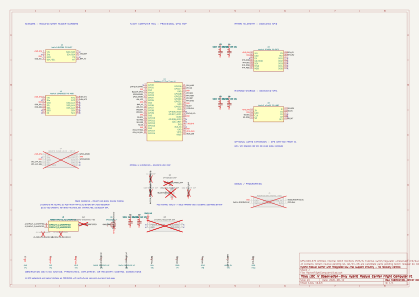

# Model Rocket Flight Computer

An experimental, observation-only flight-computer prototype: portable C++17
filtering, flight-state classification, CSV logging, fault reporting, and
versioned telemetry, with host tests and Python ground-side protocol tools.

## Hardware schematic

[](hardware/images/flight-computer-schematic.svg)

Current component-level schematic, exported from the existing KiCad design.
Open the image at full size to inspect the connections. This is a **candidate
design, not fabrication-released hardware**: battery-contact polarity, the
off-board disconnect, power integrity, and physical-interface checks remain
open. The carrier PCB is unrouted. See [hardware status](hardware/README.md).

## Safety boundary

The software observes and logs; it does not ignite motors, fire pyrotechnics,
or control recovery deployment. `APOGEE` is a classification event, not an output
command. This prototype must not replace an independently qualified recovery
system.

## What is implemented

- Sensor interfaces and a five-sample median plus exponential altitude and
  velocity filters, with range/nonfinite checks for barometer and IMU inputs.
- A nine-state classifier with consecutive-sample confirmation and fault/reset
  handling. Thresholds are initial simulation values, not flight-tuned values.
- Fixed-size CSV and `FC1` telemetry buffers, abstract logging/transport and
  watchdog interfaces, and latched fault flags.
- A deterministic synthetic classifier demonstration and dependency-free C++
  tests; Python `GPS0`/`FC1` parsing, serial-envelope compatibility, sequence-loss
  tracking, and finite synthetic/CSV replay.

The core has no MCU SDK or radio-driver dependency. Physical sensor, storage,
radio, watchdog, and retained-state adapters are not included.

## Build and test

Requires CMake 3.16+, a C++17 compiler, and Python 3.10+. Run from this directory:

```sh
cmake -S . -B build
cmake --build build --config Debug
ctest --test-dir build -C Debug --output-on-failure
python -m unittest discover -s ground_station/tests -v
```

CTest runs the flight-core tests and synthetic-flight smoke test. The Python
tests use only the standard library. See [testing](docs/testing.md) for simulator
paths, replay examples, and the verified results.

## Repository guide

| Path | Purpose |
| --- | --- |
| [`firmware/flight_computer`](firmware/flight_computer) | Portable C++ core and platform interfaces |
| [`tests`](tests) | Ten C++ test scenarios in one executable |
| [`simulations`](simulations) | Synthetic classifier demonstration, not a physics simulator |
| [`ground_station`](ground_station) | Protocol parser, encoder, replay utility, and twelve Python tests |
| [`docs/state_machine.md`](docs/state_machine.md) | Transition criteria and confirmation logic |
| [`docs/telemetry_protocol.md`](docs/telemetry_protocol.md) | Wire format and receiver envelopes |
| [`docs/status.md`](docs/status.md) | Evidence boundary and known limitations |
| [`hardware/README.md`](hardware/README.md) | Candidate hardware architecture and unfinished gates |

No raw GPS logs, imported vendor bundles, camera firmware, legacy dashboard,
personal paths, or private repository history are included. Test coordinates
are explicitly synthetic fixtures, not recorded locations.

## Provenance and licensing

Source scope, dependencies, and publication changes are documented in
[PROVENANCE.md](PROVENANCE.md). No project-wide open-source license has been
selected; public visibility alone does not grant an open-source license.
